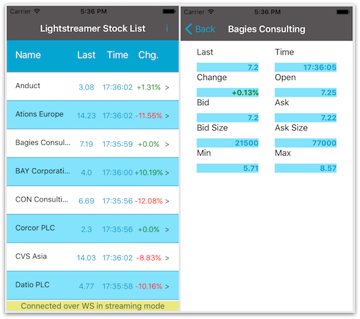

# Lightstreamer - Stock-List Demo - React Native Client

<!-- START DESCRIPTION lightstreamer-example-stocklist-client-reactnative -->

This project contains a demo application showing the integration between the Lightstreamer Node.js Client Library and React Native.

## Live Demo

[](https://itunes.apple.com/us/app/lightstreamer-stock-list-react/id1099185766?l=it&ls=1&mt=8)<br>
###[ View live demo](https://itunes.apple.com/us/app/lightstreamer-stock-list-react/id1099185766?l=it&ls=1&mt=8)<br>

## Details

This app, compatible with iPhone, is a React Native version of [Stock-List iOS Client](https://github.com/Lightstreamer/Lightstreamer-example-StockList-client-ios).<br>

This app uses the <b>Lightstreamer Node.js (formerly JavaScript) Client Library</b> to handle the communications with Lightstreamer Server. A simple user interface is implemented to display real-time market data for ten stocks generated by a feed simulator.<br>

If you want to go deeper into React Native, check out the [React Native site](https://facebook.github.io/react-native/).

## Install

Binaries for the application are not provided, but it may be downloaded from the App Store at [this address](https://itunes.apple.com/us/app/lightstreamer-stock-list-react/id1099185766?l=it&ls=1&mt=8). The downloaded app will connect to Lightstreamer's online demo server.

## Build

A full Xcode project specification, ready for compilation of the app sources, is provided. Please recall that you need a valid iOS Developer Program membership to run or debug your app on a test device.

Before you can build this demo, you need to install various required tools.

### Requirements
This guide assumes OS X which is needed for iOS development.

* Install *Xcode 7.0 or higher*. It can be installed from the App Store.

* If you don't have *Node.js* installed on your system, please go to [Node.js download page](https://nodejs.org/en/download/stable) and get the latest stable Machintosh version (it includes the also required npm).

All the following commands need to be typed on a command line window.

* Install *watchman*, for instance with [Homebrew](http://brew.sh) by doing:

```sh
$ brew install watchman
```

* Install the *React Native command line tools*: (if you see the error *EACCES: permission denied*, please run the command preceded by sudo)

```sh
$ npm install -g react-native-cli
```

* Go into the *Lightstreamer-example-StockList-client-reactnative* folder and get dependencies with command:

```sh
$ npm install
```

### Compile and Run

* Create an *app ID* on the [Apple Developer Center](https://developer.apple.com/membercenter/index.action).
* Create and install an appropriate provisioning profile for the app ID above and your test device, on the Apple Developer Center.
* Set the app ID above as the *Bundle Identifier* of the Xcode project of the app.
* Set the IP address of your local Lightstreamer Server in the constant `SERVER_ADDRESS`, defined in `components/Constants.js`.
* Follow the installation instructions for the Data and Metadata adapters required by the demo, detailed in the [Lightstreamer - Stock-List Demo - Java Adapter](https://github.com/Lightstreamer/Lightstreamer-example-StockList-adapter-java) project.

Done this, the app should run correctly on your test device and connect to your server.

If you simply want to build and run the demo app on the *iPhone Simulator*, you need to change the JavaScript code location, because no pre-bundled file is generated when running the project on it in the "Debug" build configuration. You must open *AppDelegate.m* file, comment out the second option (which uses pre-bundled file) and instead enable the first.

### Babel Note

As of version 0.5.0, React Native ships with the *Babel JavaScript compiler*. It make writing code more enjoyable by allowing you to use new JavaScript ES6 syntax. Anyway, we need to ignore <b>Lightstreamer Client npm module</b> from Babel transformation in order to avoid problem with ES6 module code specification, which is interpreted as strict mode code
(see *.babelrc* file in project folder).

## See Also

### Lightstreamer Adapters Needed by This Demo Client

* [Lightstreamer - Stock- List Demo - Java Adapter](https://github.com/Lightstreamer/Lightstreamer-example-Stocklist-adapter-java)
* [Lightstreamer - Reusable Metadata Adapters- Java Adapter](https://github.com/Lightstreamer/Lightstreamer-example-ReusableMetadata-adapter-java)

### Related Projects

* [Lightstreamer - Stock-List Demos - HTML Clients](https://github.com/Lightstreamer/Lightstreamer-example-Stocklist-client-javascript)
* [Lightstreamer - Stock-List Demo - iOS Client](https://github.com/Lightstreamer/Lightstreamer-example-StockList-client-ios)
* [Lightstreamer - Stock-List Demo with APNs Push Notifications - iOS Client](https://github.com/Lightstreamer/Lightstreamer-example-MPNStockList-client-ios)
* [Lightstreamer - Stock-List Demo - Android Client](https://github.com/Lightstreamer/Lightstreamer-example-AdvStockList-client-android)
* [Lightstreamer - Basic Stock-List Demo - OS X Client](https://github.com/Lightstreamer/Lightstreamer-example-StockList-client-osx)
* [Lightstreamer - Basic Stock-List Demo - Windows Phone Client](https://github.com/Lightstreamer/Lightstreamer-example-StockList-client-winphone)
* [Lightstreamer - Basic Stock-List Demo - Electron Client](https://github.com/Lightstreamer/Lightstreamer-example-StockList-client-electron)
* [Lightstreamer - Basic Stock-List Demo - HTML (React) Client](https://github.com/Lightstreamer/Lightstreamer-example-StockList-client-react)

## Lightstreamer Compatibility Notes

* Compatible with Lightstreamer Node.js (formerly JavaScript) Client Library 6.2.7 or newer.
